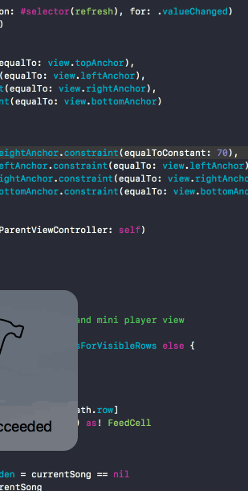

### Bandlab test assignment
# KMP3

This is a simple player app for showing list of songs and playing them.

Data is fetched from [this](https://gist.githubusercontent.com/anonymous/fec47e2418986b7bdb630a1772232f7d/raw/5e3e6f4dc0b94906dca8de415c585b01069af3f7/57eb7cc5e4b0bcac9f7581c8.json).

Time spent: <13 hours>

### Features

#### Required

- [x] Do not use 3rd party libraries, do not copy/paste code from 3rd party libraries.

- [x] Use git for local development.

- [x] Use Swift 4

- [x] Make sure the app has enough unit tests coverage.

#### Bonus tasks

- [x] Create a mechanism to cache streaming audio files. If User wants to a play a cached song, we should played a locally cached file instead of doing remote streaming.

- [x] Make the app work in offline mode.

### Walkthrough

GIF created with [LiceCap](http://www.cockos.com/licecap/).
